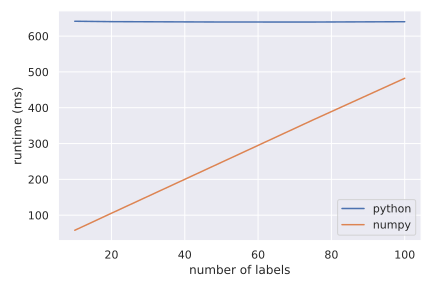
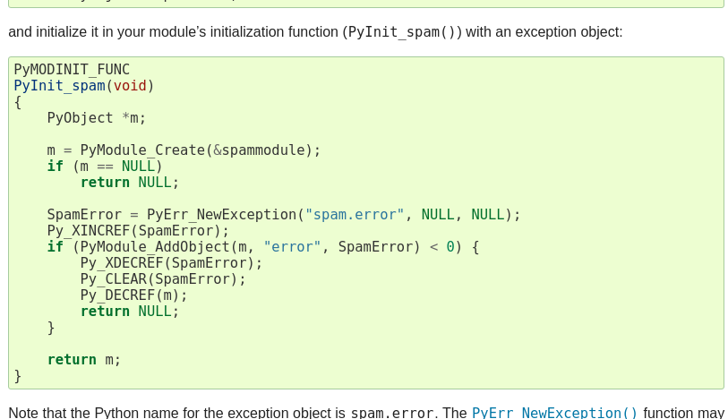
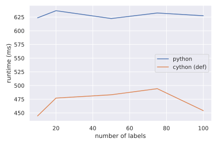

class: center, middle

# Why should you learn writing C extensions?

## Gavin Chan

## Principal Quant Developer, AXA IM Chorus Ltd


---

# My Background

.center[

]

- Working as a principal quant developer in AXA IM Chorus Ltd, which
is a quantitative asset management firm.

- Major language: Python

- Worked in Fidessa as a C++ developer

- Personal Python open source projects: [BitcoinExchangeFH](https://github.com/BitcoinExchangeFH/BitcoinExchangeFH), [LightMatchingEngine](https://github.com/gavincyi/LightMatchingEngine)

---

# Objective

- Understand the performance bottleneck on CPU bound problems

- How to work around it by C extensions

- Modern tools to write C extensions


---

# Problem - Weighted sum on labels

Provided a list of labels, compute the weighted sum for each label.


```python
labels  = [   0,   2,   1,   1,   2,   0 ]
weights = [ 0.1, 0.5, 0.2, 0.3, 0.8, 0.6 ]
```

__Result__

```python
assert weighted_sum == [0.7, 0.5, 1.3]
```

---

# Problem - Weighted sum on labels

#### For loop

```python
for idx in range(len(weights)):
    weighted_sum[labels[idx]] += weights[idx]
```

#### List comprehension

```python
weighted_sum = [
    sum([weights[idx] for idx in range(len(weights)) 
         if labels[idx] == label])
    for label in max(labels)
]
```

#### Numpy

```python
weighted_sum = [
    (labels == label).dot(weights)
    for label in range(max(labels))
]
```
---

##  Performance - Python O(N) v.s. Numpy O(M x N)

.center[]
<div class="center">
.center[###### Median time of 1000 runs on the weighted sum on labels (1000 instruments) (in microseconds)]
</div>

---

# How Python works?

- Python is an interpreted language

- Python first compiles the source code into a bytecode

```python
from dis import dis

dis(get_python_risk_exposures)
```

```python
  2           0 LOAD_GLOBAL              0 (np)
              2 LOAD_ATTR                1 (zeros)
              4 LOAD_FAST                2 (num_of_labels)
              6 LOAD_GLOBAL              0 (np)
              8 LOAD_ATTR                2 (float64)
             10 LOAD_CONST               1 (('dtype',))
             12 CALL_FUNCTION_KW         2
             14 STORE_FAST               3 (risk_exposures)
```

- The bytecode is sent and executed on Python Virtual Machine (PVM)

---

# Extending Python with C / C++

- Extended with CPython API and compiled to a shared library (`.dll` in Windows / `.so` in Unix)

- The shared library is imported as a Python module

.center[

]

- Caveat: Supported only in CPython but not in PyPy

---

# Well, it looks difficult...

- Compilation and Linkage 

  * e.g. test_module.cpython-35m-x86_64-linux-gnu.so

- Reference count 

  * Py_INCREF / Py_DECREF

- Ownership rules

- Exception handling

  * PyErr_SetString

---

# Modern tools

- Cython: Syntax alike Python, used by numerous scientific and quant libraries, e.g. scipy, pandas and sklearn

- Pybind11: Binding Python with C++11

- Numba: Just in time compilation by LLVM

- Others

  * SWIG: Interface compiler connecting C / C++ with Python

  * Pythran: Compile on native python module by comments as hints

  * cffi: Dynamic runtime interface to native code in Python
---

# Cython - Classical approach

- First rename the python extension (.py) to cython extension (.pyx)

```python
import numpy as np

def get_cython_def_risk_exposures(labels, weights, num_of_labels):
  risk_exposures = np.zeros(num_of_labels, dtype=np.float64)
  weight_len = len(weights)

  for idx in range(weight_len):
      risk_exposures[labels[idx]] += weights[idx]

  return risk_exposures  
```

---

# Cython - Classical approach

- Even compiling the native python code in cython can get 20% - 30% performance gain. 

.center[]

<div class="center">
.center[###### Median time of 1000 runs on the weighted sum on labels (1000 instruments) (in microseconds)]
</div>

---

# Cython - Classical approach

- To achieve C runtime, you may need to declare the function as `cpdef` and `cdef`

- `cpdef` is a hybrid function, accessible in Python but using the faster C calling conventions

- `cdef` is a pure C function which is not accessible in Python level

---

# Cython - Classical approach

```python
import numpy as np


cpdef get_cython_cpdef_risk_exposures(
        long[:] labels, 
        double[:] weights, 
        int num_of_labels):
    """Compute exposures by iterating the weights.
    """
    cdef:
        np.ndarray[np.float64_t, ndim=1] exposures = (
            np.zeros(num_of_labels, dtype=np.float64)
        )
        Py_ssize_t idx, label
        Py_ssize_t weight_len = len(weights)
        np.float64_t label_exposure
        double[:] exposures_view = exposures

    for idx in range(weight_len):
        exposures_view[labels[idx]] += weights[idx]

    return exposures
```

---

# Cython - Classical approach

- Performance improves greatly working in the array memory view

<div class="center">
.center.pure-table.pure-table-bordered[
|   labels |   python |   cython (def) |   cython (cpdef) |
|---------:|---------:|---------------:|-----------------:|
|       10 |  612.48  |        452.210 |            4.901 |
|       20 |  656.188 |        485.757 |            4.952 |
|       50 |  663.531 |        494.514 |            4.870 |
|       75 |  645.385 |        477.440 |            4.857 |
|      100 |  643.298 |        474.337 |            4.917 |
]

.center[###### Median time of 1000 runs on the weighted sum on labels (1000 instruments) (in microseconds)]
</div>

---

# Pybind11 - Approach from C++11 world


```cpp
#include <pybind11/pybind11.h>
#include <pybind11/stl.h>
#include <pybind11/numpy.h>

using namespace std;
namespace py = pybind11;

/* Return the portfolio exposures as numpy array */
py::array_t<double> iterate_weight(    /* Return numpy array */
    py::array_t<int64_t>* labels,       /* Accept numpy array */
    py::array_t<double>* weights,       /* Accept numpy array */
    uint32_t num_of_labels)
{
    auto exposures = py::array_t<double>( num_of_labels );

    /* Read and write the buffer without boundary check */
    auto unchked_exposures = exposures.mutable_unchecked<1>();
    auto unchked_labels = labels->unchecked<1>();
    auto unchked_weight = weights->unchecked<1>();

    /* Add the exposure */
    for (size_t idx = 0; idx < weights->size(); idx++) 
        unchked_exposures[unchked_labels[idx]] += unchked_weight[idx];

    return exposures;
}
```

---

# Pybind11 - Approach from C++11 world

- Bind the C / C++ functions into Python

- Specify the ownership policy - Return Value Policy

- Specify the docstring and the argument names in the binding function

- You can specify function overloading in binding the function as well

```cpp
PYBIND11_PLUGIN(example) {
    py::module m("example");
    m.def("get_pybind11_risk_exposures", 
          &iterate_weight,
          py::return_value_policy::move,
          "Iterate weight on list.",
          py::arg("labels").noconvert(), 
          py::arg("weights").noconvert(), 
          py::arg("num_of_labels").noconvert());
    return m.ptr();     
}
```

--- 

---

# Numba - A rising new star

- Numba first convert the source to bytecode and then compile bytecode to machine code on the fly (object mode)

- Meanwhile, Numba can compile in the path without any calls into Python C API (nopython mode)

- Support ahead-of-time (AOT) compilation

- Support CUDA GPU programming

---

# Numba - A rising new star

```python
from numba import jit

@jit(nopython=True)
def get_numba_risk_exposures(labels, weights, num_of_labels):
  risk_exposures = np.zeros(num_of_labels, dtype=np.float64)
  weight_len = len(weights)

  for idx in range(weight_len):
      risk_exposures[labels[idx]] += weights[idx]

  return risk_exposures
```

```python
import numba as nb
from numba import njit

@njit(nb.float64[:](nb.int64[:], nb.float64[:], nb.int64))
def get_numba_risk_exposures(labels, weights, num_of_labels):
  risk_exposures = np.zeros(num_of_labels, dtype=np.float64)
  weight_len = len(weights)

  for idx in range(weight_len):
      risk_exposures[labels[idx]] += weights[idx]

  return risk_exposures
```

--- 

---


# Performance - Cython v.s. pybind11 v.s. Numba

<div class="center">
.center.pure-table.pure-table-bordered[
|   labels |   cython |   pybind11 |   numba |
|---------:|---------:|-----------:|--------:|
|       10 |  4.98033 |    3.89457 | 2.06971 |
|       20 |  4.87757 |    3.85737 | 1.99318 |
|       50 |  4.80866 |    3.83329 | 1.95670 |
|       75 |  4.63414 |    3.88455 | 1.91998 |
|      100 |  4.64511 |    3.87454 | 1.90687 |
]

.center[###### Median time of 1000 runs on the weighted sum on labels (1000 instruments) (in microseconds)]
</div>

---

# Comparison

### Cython

Pros: Still a very stable tool for development. Minimal infrastructure requirement.

Cons: Does not catch up with the model development tools, e.g. GPU programming

### Pybind11

Pros: Excellent performance

Cons: Requires knowledge / experience in C / C++ development

### Numba

Pros: Excellent JIT compilation performance. Best performance in interactive usage.

Cons: Distribution. Unclear switch between nopython and object mode.

---


class: center, middle

### Colab example: [https://bit.ly/2YFSm3F](https://bit.ly/2YFSm3F)

### Github: [@gavincyi](https://github.com/gavincyi)

### Email: [gavincyi@gmail.com](https://bit.ly/2YFSm3F)

### Linkedin: [Gavin, Ying In Chan](https://www.linkedin.com/in/gavin-ying-in-chan-43b00127/)

---

# Reference

[Extending Python with C or C++](https://docs.python.org/3/extending/extending.html)

[Understanding Python Bytecode](https://towardsdatascience.com/understanding-python-bytecode-e7edaae8734d)

[Interfecing with C, Scipy lecture notes](https://scipy-lectures.org/advanced/interfacing_with_c/interfacing_with_c.html)

[Replace SWIG with pybind11](https://github.com/tensorflow/community/blob/master/rfcs/20190208-pybind11.md)
